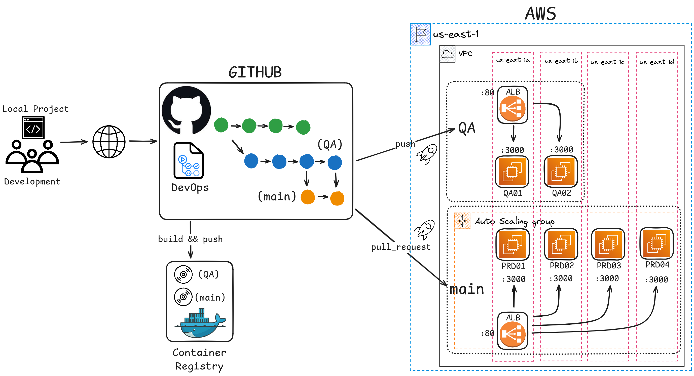
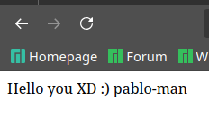

## Architecture

# Configuration on AWS
## Instances
* Two for testing (QA)
* Four for production (main)

## VPC
* Four subnets, each in a different availability zone from a to z
* Each instance must be deployed in a different subnet to ensure high availability

## Security Group
* For this example, two different security groups were created, one for QA and another for main. The required inbound rules are: `SSH`, port `:3000`, and `HTTP`.

## Key Pairs
* One key per environment in `.pem` format

## Application Load Balancer

## Auto Scaling Group

# Project Description
A basic project developed with Node.js that exposes a `GET` endpoint at the root path, returning a **Hello World** message along with the host name where it is running.

## Deployment on EC2
The deployment type on the instances is via Docker. The container internally operates on port 3000 and maps this port to port 3000 of the instance.

## Result

# Pipeline
## Explanation of the YAML Files

These three YAML files are part of a CI/CD system designed to manage the building, deployment, and updating of Docker-based applications on AWS EC2 instances. Here's what each file does:

---

### 1. **`cd.yml` (Main Workflow File)** :contentReference[oaicite:0]{index=0}:
This file defines the main workflow for deploying Docker applications to EC2 instances. Key actions include:
- **Trigger Events**:
  - Automatically deploys on a **push** to the `QA` branch.
  - Executes actions on a **pull request** to the `main` branch.
- **Sub-Workflows**:
  - Calls the workflows defined in `login_pull.yml` to authenticate to Docker Hub and pull the required images for the `QA` or `main` environment.
  - Configures and deploys Docker images on multiple EC2 instances using `setup_docker.yml`.
- **Specific Parameters**:
  Each environment (`QA` and `main`) uses its own access keys, hosts, and Docker repository names.

---

### 2. **`login_pull.yml` (Docker Hub Login and Image Build)** :contentReference[oaicite:1]{index=1}:
This file is a reusable workflow to:
- Authenticate to Docker Hub using a username and password (stored as secrets).
- Build a new Docker image from the current source code.
- Push the image to Docker Hub with the `latest` tag.

**Purpose**:
Facilitates the creation and storage of Docker images that will be used in deployments.

---

### 3. **`setup_docker.yml` (EC2 Instance Configuration)** :contentReference[oaicite:2]{index=2}:
This file defines a reusable workflow to:
- Connect to EC2 instances via SSH.
- Install Docker if it is not already installed and ensure the service is active.
- Pull the latest version of the Docker image from Docker Hub.
- Stop any existing containers and deploy the new image, ensuring the application runs on port 3000.

**Purpose**:
Ensures EC2 instances are correctly configured and always run the latest version of the application.

---

### **Overall Workflow**:
1. **Push to QA**:
   - The Docker image is built and deployed to QA instances (`QA01` and `QA02`).
2. **Pull Request on `main`**:
   - The code is validated and, upon approval, deployed to production instances (`PRD01` to `PRD04`).
3. **During Each Deployment**:
   - EC2 instances are automatically updated with the latest version of the application from Docker Hub.

Let me know if you need further clarification or details!

